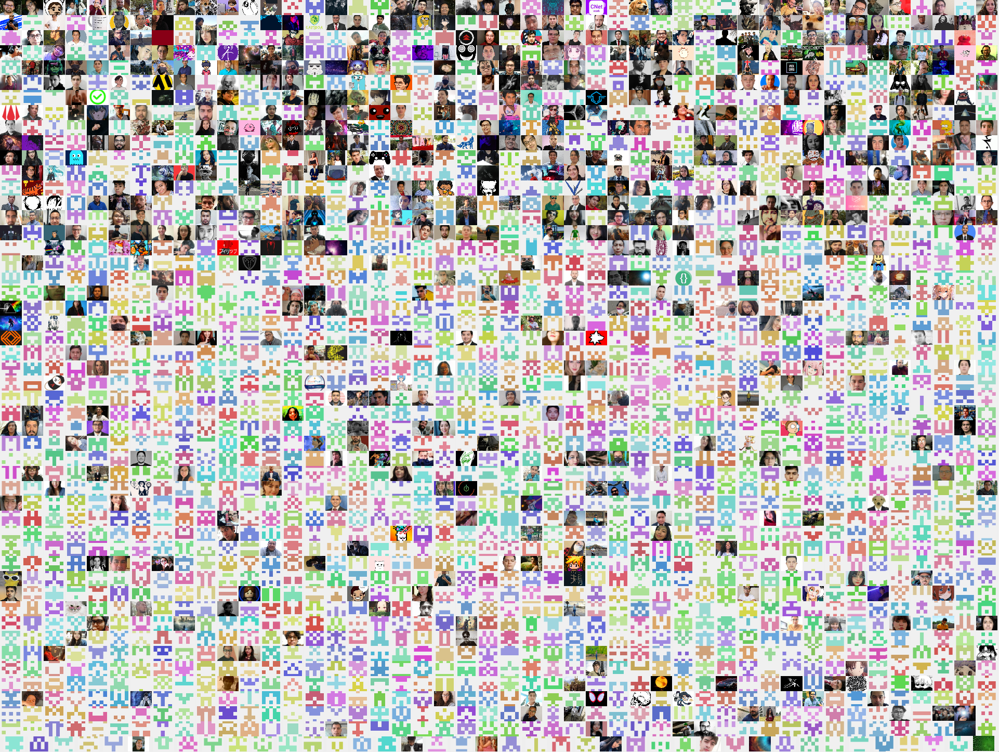

# Yearbook 👩‍🦰👨‍🦱👩‍🦱👦🧑👨‍🎓

Do you want to create a collage from a GitHub group? contact me!

Check this out! https://yearbook-nodejs.herokuapp.com/

 

<a href="https://yearbook-nodejs.herokuapp.com/" title="Yearbook InnovaVirtual Jun 2022 AZ900!"> <h1>Yearbook InnovaVirtual Jun 2022 AZ900</h1> </a>

 

<a href="https://yearbook-nodejs.herokuapp.com/" title="Yearbook LaunchX May 2022 Woopa!"> <h1>Yearbook LaunchX May 2022 NodeJS</h1> </a>

